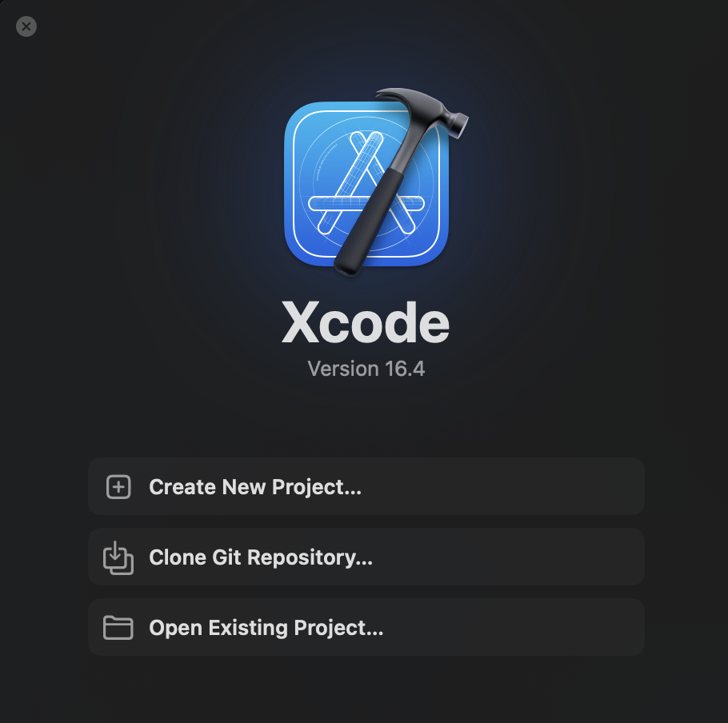
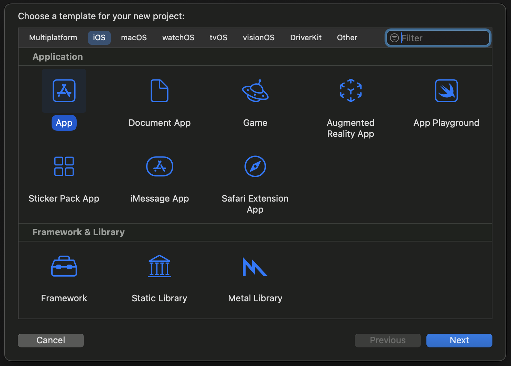
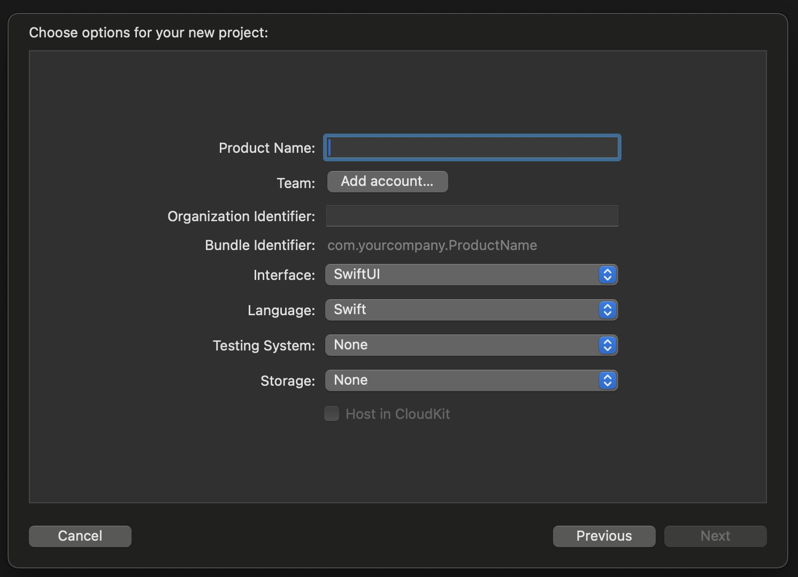

## How to make an app - Leason 1

### Chapter 1 - The App store process

Xcode is the IDE (Intergrated Development Enviroment) we will be using to create our apps. We will be using a language called `Swift` which is the native Apple programming language. We will also be using `SwiftUI` which is a UI framework that makes it easier to build apps quicker for all Apple platforms.

With Xcode, we can make apps for:
- IOS
- iPadOS
- tvOS
- watchOS
- macOS
- visionOS

To distribute the app, you can use Apples App Store. To do this, you need to joing the Apple Developer Program. Once enrolled, you get access to:
- App Store Connect - where you create your app listing.
- TestFlight - allows you to give your app to bug testers for testing.
- Developer Portal - allows you to codesign your app (good for security).
- Access to beta software

When you are ready to upload your app, you will export it from Xcode and upload it to the `App Store Connect` where the certification team at Apple will review your app and report any changes that need to be made. Once approved, your app will then be live in the app store.

You don't have to join the Apple Developer Program if you only want to build apps for your self.

-----

### Chapter 2 - Downloading Xcode

To get Xcode, you can download it from the app store on your devide. Swift and SwiftUI all come with Xcode.

[Link to Xcode](https://apps.apple.com/gb/app/xcode/id497799835?mt=12)

-----

### Chapter 3 - Start a New Xcode Project

To start a new Xcode project, you can click `Create new project` or you can go to the toolbar at the top on the screen and do `File -> New -> Project...`. 

After that, a window will apear where you can choose which operating system you want to build your app for.

For this lesson, we will choose `IOS` and `App`.

Next, you will be asked to provide information such as the name of your app, your organisation, etc,. 

We will come back to this is lesson 2. For now, we will call this app `L1 Demo`. We will use `SwiftUI` for our interface and `Swift` for our programming language.

For now, we will uncheck `Use Core Data` and `Include Tests`. We will look more at these in future lessons.

And finally, we will need to choose a place to store our project. Here you can also create a `git repo` for our project that is a great place to backup your project. For now, we will leave this unchecked.

-----

### Chapter 4 - Add images to the App Project 

